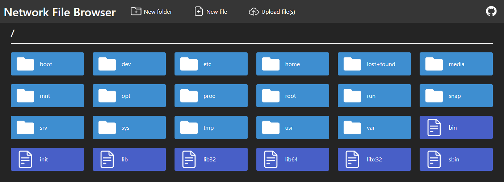
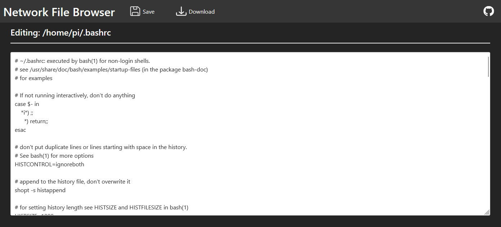

# Network File Browser

View and interact with a file system over a network with Network File Browser. A single binary file is all you need to host an entire directory through a beautiful web interface; all dependencies are included in the binary. Run it on a storage server to view and upload/download files without needing to install anything on a client device.

**PLEASE NOTE: This program was developed by an amateur programmer with very little web development experience. As such it contains janky code and may be prone to breaking in almost every way. Please be advised.**

**LIMITATION**: Due to the server-side-rendered nature of this program, when uploading files or creating a new file/folder through the web interface, any existing item with the same name (in that directory) will be overwritten without prompt. I'm new to web development so don't know an easy way to change this.

**INSPIRATION**: Inspired by the amazing [Filebrowser](https://github.com/filebrowser/filebrowser) program.

## Features

- View file and folder structure
- Download files
- Upload files
- Create new files and folders
- Edit files as text
- **(Coming soon)** Rename files and folders
- **(Coming soon)** Delete files and folders
- **(Coming soon)** User authentication

## Usage

To host a directory with Network File Browser, run the command: ``file-browser -v "[PATH]"``

Use the ``-p`` flag to specify a port; 8080 by default. 

**(Optional)** Set this command to run on device start-up to ensure that the desired path's web interface is always available.

## Building

Pre-built binaries are available on the GitHub page.

```
git clone https://github.com/odddollar/File-browser.git
cd File-browser
go build
```

Use ``go build -ldflags="-s -w"`` in place of ``go build`` to produce a significantly smaller binary.

## Technologies

Developed on Windows, but should work on Linux and Mac. I've tested with WSL2 and it seems to work, but further testing on a native Linux machine is probably necessary.

- Backend: [Gin](https://gin-gonic.com/) web framework for Go
- Frontend: 
  - Server-side rendered with Go's [http/template](https://pkg.go.dev/html/template) standard library
  - [Bulma](https://bulma.io) providing styling
  - Vanilla JavaScript for the odd bit of frontend logic
- Go's Embed library to package all static files to a single binary

## Screenshots




